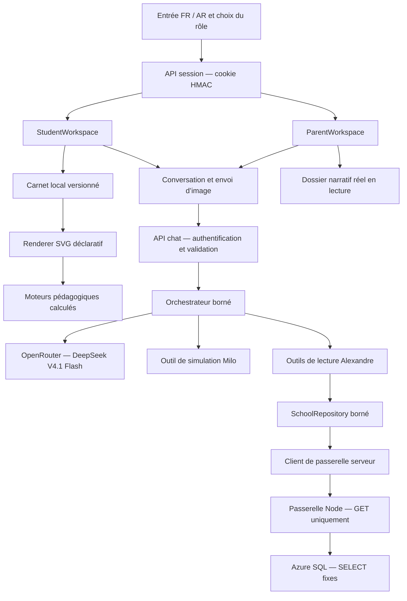

# AlexandreBOT — conception et périmètre livré

## 1. Les deux expériences

**Milo, 6–12 ans.** Un renard SVG animé accueille l’enfant. L’atelier associe conversation et tableau : côte à côte sur ordinateur, deux onglets sur téléphone. L’âge est réglable. Toute l’interface existe en français et en arabe, avec direction RTL. Les pages du carnet conservent leurs dessins, paramètres et quiz sur l’appareil.

Milo peut répondre simplement, construire un dessin inédit à partir de primitives SVG, créer une expérience calculée, poser une question ou modifier des objets existants. L’enfant peut toucher une figure, déplacer les objets autorisés, dessiner au doigt, annuler un trait, transmettre une image du tableau à Milo ou joindre une photo d’exercice. La lecture vocale utilise les voix disponibles dans le navigateur.

**Alexandre, espace parent.** Un avatar SVG souriant en djellaba et casquette accompagne un dossier réel lu dans Azure SQL : identité, parcours, classes, résultats annuels, résultats par matière et semestre, apprentissages, absences, messages et devoirs. La fiche de l’enfant change selon la discussion entre synthèse, parcours, résultats, présence, dossier et accompagnement. Les catégories vides sont montrées comme telles. La conversation produit une synthèse naturelle avec période et provenance. Aucun score de « bien-être », diagnostic ou état émotionnel n’est déduit des notes ou de l’assiduité.

Les deux boutons d’entrée créent des sessions HTTP signées. L’authentification reste volontairement factice pour le pilote local ; le rôle parent reçoit cependant un périmètre serveur fixe vers un seul dossier pilote. Aucun identifiant scolaire ne vient du navigateur ou du modèle.

## 2. Architecture logicielle

| Module | Responsabilité | Point d’extension |
| --- | --- | --- |
| `app/page.tsx` | Entrée et reprise de session | Nouvelle identité indépendante du choix visuel de rôle |
| `components/alexandre/student-workspace.tsx` | Parcours enfant et coordination du carnet | Nouvelle activité ou interaction pédagogique |
| `components/alexandre/board.tsx` | Dessin, sélection, déplacement et capture | Nouveau renderer de primitive déclaré dans le contrat |
| `components/alexandre/experiments.tsx` | Contrôles et rendu des cinq expériences | Nouveau moteur calculé et commandes accessibles |
| `lib/physics.ts` | Calculs déterministes en unités SI | Modèle physique testé séparément du rendu |
| `hooks/use-notebook.ts` / `lib/notebook.ts` | Stockage local et mutations des pages | Adaptateur de persistance propre à AlexandreBOT |
| `hooks/use-conversation.ts` | Historique, attente, annulation, reprise | Streaming ou stockage de conversations hors base scolaire |
| `lib/contracts.ts` | Contrat partagé Zod des scènes et réponses | Versionner les changements incompatibles |
| `server/agents/orchestrator.ts` | Appels OpenRouter, validation et réparation | Changer le modèle via variable serveur |
| `server/agents/parent-grounding.ts` | Résumé canonique et contrôle des faits parent obligatoires | Ajouter un contrôle lié à une nouvelle intention |
| `server/agents/tools.ts` | Catalogue autorisé par rôle | Ajouter une capacité explicite, jamais du SQL libre |
| `lib/parent-focus.ts` | Choix déterministe de la fiche parent liée à la question | Ajouter un nouveau contexte visuel |
| `components/alexandre/parent-overview.tsx` | Fiche Aamar contextuelle et mobile | Ajouter une vue de dossier bornée |
| `server/school/repository.ts` | Normalisation des lectures réelles autorisées | Ajouter un DTO borné après revue du schéma |
| `server/school/gateway-client.ts` | Transport serveur vers la passerelle | Brancher un vérificateur d’identité scolaire |
| `services/school-gateway` | Requêtes nommées et paramétrées en lecture | Nouvelle requête auditée et testée |

Le frontend n’importe aucun secret. Les routes serveur possèdent la clé OpenRouter et uniquement le jeton de la passerelle. Le pilote SQL reste dans un service Node distinct, car le runtime web Workers ne fournit pas directement un client TDS SQL Server. Le périmètre demandé reste local : aucun déploiement n’a été effectué.

## 3. Contrat pédagogique de Milo

Chaque réponse contient `message`, `boardAction`, `scene`, `removeShapeIds`, `quiz`, `suggestions`.

| Action | Effet |
| --- | --- |
| `keep` | Conversation seule. Le carnet, le dessin et les réglages restent identiques. |
| `new` | Une nouvelle page est ajoutée. Les anciennes ne sont pas effacées. |
| `update` | La page courante évolue. Les objets sont fusionnés par identifiant ; les traits de l’enfant restent présents. |

`removeShapeIds` permet une suppression ciblée d’objets du modèle. Il n’existe pas de commande d’effacement global du carnet dans les outils de l’agent. Les quiz sont associés à leur page ; leurs corrections restent accessibles en revenant à cette page.

Les traits violets sont stockés séparément des formes produites par Milo. Lorsqu’une page en contient, l’envoi d’un message capture automatiquement le rendu actuel et joint `childDrawing.strokeCount`. Le prompt et les validateurs attribuent alors les traits violets à l’enfant et les formes structurées à Milo. « J’ai dessiné quoi ? » doit conserver la page ; « résous/corrige/explique mon dessin » doit enrichir cette même page. Une réponse qui prétend que le tableau est vide, évalue les propres formes de Milo comme réponse de l’enfant ou remplace la page lors d’une simple inspection est refusée avant affichage.

Le modèle produit des **descriptions de scènes**, jamais du JavaScript ou du SVG brut exécuté. Les primitives autorisées sont `circle`, `rect`, `text`, `line`, `path`, `sticker`. Les couleurs sont des hexadécimaux et les tracés n’acceptent que des commandes géométriques numériques. Le renderer React construit lui-même les éléments SVG. Aucun `eval`, HTML arbitraire, URL distante de scène ou script généré n’est accepté.

Les animations déclaratives proposées sont flottement, pulsation, rotation, balancement, rebond et orbite. Une scène libre peut associer plusieurs formes, textes, dessins, révélations au toucher et déplacements. Le modèle choisit cette construction pour les sujets qui ne nécessitent pas de moteur physique.

### Outils de Milo

`create_interactive_simulation` valide les paramètres et prépare une scène. L’appel est facultatif : un bonjour ou une question sur une figure ne force pas une nouvelle expérience. Le même contrat de simulation peut également être renvoyé directement dans une scène structurée.

Le catalogue reste volontairement petit. La vision du tableau est un contexte multimodal, et le dessin SVG libre est une sortie structurée : les transformer en outils séparés ajouterait des choix qui se recouvrent. L’unique outil enfant regroupe les cinq expériences qui partagent le même contrat et le même moteur d’interaction ; il n’est exposé au modèle que lorsqu’une intention de simulation est détectée. Cette décision suit les recommandations de [l’OpenAI Practical Guide to Building Agents](https://openai.com/business/guides-and-resources/a-practical-guide-to-building-ai-agents/) et de [Writing effective tools for AI agents d’Anthropic](https://www.anthropic.com/engineering/writing-tools-for-agents) : outils distincts et bien définis, peu de chevauchement, activation liée au besoin et évaluations fondées sur les parcours réels. Un nouvel outil sera ajouté seulement s’il apporte un calcul déterministe ou un effet différent, avec son propre contrat et ses tests.

| Expérience | Interactions | Modèle et limites |
| --- | --- | --- |
| Ballon | Départ/pause, hauteur 1–5 m, restitution, Terre/Lune, sélection de la trajectoire | Chute et rebonds balistiques, sans résistance de l’air. La trajectoire comporte aussi un déplacement horizontal. |
| Balançoire | Longueur 0,5–2,5 m, lecture/pause | Approximation du pendule aux petites oscillations ; valeur pédagogique simplifiée. |
| Orbite | Lecture/pause et vitesse | Schéma circulaire illustratif, distances et vitesses non à l’échelle. |
| Eau | Lecture/pause, vitesse et sélection | Cycle illustré : évaporation, condensation, précipitation, retour. |
| Fractions | Parts 2–12 et sélection des parts | Le nombre sélectionné est recalculé dans le renderer. |

Les animations décoratives respectent la préférence de mouvement réduit. Les simulations démarrent en pause et possèdent un bouton d’arrêt. Les dessins générés conservent un espace logique 800 × 500, redimensionné sans déformation.

### Exemple de continuité

1. « Comment le ballon rebondit ? » → page A avec simulation et trajectoire.
2. L’enfant change la hauteur et lance l’expérience → paramètres de A sauvegardés.
3. « Pourquoi redescend-il ? » → explication, `keep`.
4. « Mets le même ballon sur la Lune » → `update` sur A.
5. « Dessine une plante qui grandit » → page B composée et animée par Milo.
6. Retour à A → retrouvailles avec le ballon, ses paramètres et les traits de l’enfant.

## 4. Architecture d’Alexandre

Les neuf outils `read_child_overview`, `read_learning`, `read_attendance`, `read_school_messages`, `read_homework`, `read_school_journey`, `read_year_results`, `read_subject_results` et `read_term_results` n’acceptent aucun identifiant choisi par le modèle. Le serveur résout l’inscription pilote depuis la session HMAC et la passerelle revérifie la relation avec le parent mappé et l’année en cours.

Les neuf lectures démarrent en parallèle avant la génération. Le modèle reçoit un résumé canonique avec les couples année/classe et les valeurs normalisées. Une validation liée à la question exige les faits essentiels et rejette une mauvaise association année/classe ; deux corrections peuvent être demandées avant l’échec final. L’agent distingue observation datée, absence de donnée et suggestion d’accompagnement. Il peut proposer une courte activité ou aider à rédiger une question pour l’école. Il ne peut ni envoyer de message, ni prendre de rendez-vous, ni modifier le dossier.

Le parent reçoit une explication compréhensible : une réussite, une difficulté précise, une proposition raisonnable, la date des observations et ce que ces observations ne permettent pas de conclure. L’absence d’un enregistrement d’absence ne devient pas une affirmation de bien-être ou de présence exhaustive.

## 5. Base existante : découverte et modèle de lecture

L’inventaire initial fourni contient **243 tables et 3 966 colonnes**, avec 53 relations de colonnes de clés étrangères. La vérification Azure en direct a recensé **124 vues** : 115 dans `dbo`, 4 dans `gsalexandre` et 5 dans `usergs1`. Le dossier pilote n’est pas importé : il est relu à la demande par la passerelle locale.

Sources livrées : `school-schema.json`, `school-relations.json`, `school-view-definitions.json`. Le dernier fichier contient la définition textuelle des vues initialement ciblées. Les instructions `CREATE VIEW` présentes dans ce fichier sont des métadonnées lues, elles n’ont pas été exécutées.

| Besoin | Vue ou table sélectionnée | Périmètre nécessaire |
| --- | --- | --- |
| Enfants du parent | `VCondultation_Parent_Etudiant` | `Parent_ID`, `EtudiantNiveauAnnee_ID`, `Annee_Encours=1` |
| Apprentissages | `VConsultation_Resultat_Apprentissage` | `ResultatApprentissage_EtudiantNiveauAnnee_Id` et existence de la relation parent |
| Absences | `VAbsenceMatiere` | `EtudiantNiveauAnnee_ID` et relation parent |
| Messages direction | `VConsultation_MessageDirection` | `EtudiantNiveauAnnee_ID` et relation parent |
| Devoirs de classe | `Devoirs` | Classe de l’inscription autorisée de l’année en cours |
| Parcours annuel | `Etudiant_Niveau_Annee`, `Etudiant_Classe`, `Annee`, `Niveau`, `Classe` | Élève dérivé de l’inscription autorisée et relation parent actuelle |
| Résultats annuels, matières, semestres | `V_Consultation_ExamenNote` | Élève dérivé de l’inscription autorisée, années 2023/2024 et 2024/2025, notes valides ramenées sur 20 |

**Jointure importante vérifiée dans les vues :** le champ `Etudiant_Parent.Etudiant_ID` joint en réalité `Etudiant_Niveau_Annee.EtudiantNiveauAnnee_ID`. Son nom est trompeur : il ne faut pas le joindre directement à l’identifiant de la table `Etudiant`. La passerelle utilise donc l’identité d’inscription annuelle exposée par la vue parent.

La vue des résultats comporte un `RIGHT OUTER JOIN` vers le catalogue de cours. Une ligne de catalogue sans résultat ne doit pas devenir un résultat d’élève. La requête retenue impose une inscription non nulle, égale à l’inscription autorisée. Les évaluations de compétences traversent également les inscriptions : tout futur élargissement doit conserver le filtre d’année et vérifier les clés réellement utilisées.

Les requêtes sont limitées par `TOP`, triées, paramétrées et choisies dans une liste fixe. Le modèle ne voit jamais de connexion SQL et ne peut choisir ni requête libre, ni table, ni identifiant d’un autre parent.

## 6. Lecture seule et frontières de confiance

- **Aucune écriture dans la base du groupe scolaire.** Aucun outil d’écriture, migration, création d’utilisateur, modification de permission ou commande SQL générée n’est utilisé.
- La passerelle vérifie les permissions effectives et exige normalement un compte limité à `SELECT`. Le pilote local active explicitement une exception de démarrage parce que le principal fourni est administrateur ; cette exception ne modifie pas la liste de requêtes fixes et doit disparaître avant toute exposition réseau.
- `readOnlyIntent` est une indication de routage SQL Server ; la sécurité repose sur les permissions réelles et les requêtes fixes, pas sur ce paramètre seul.
- Les secrets de connexion résident uniquement dans le fichier local ignoré `services/school-gateway/.env`. Aucun changement de droits n’a été effectué sur cette base.
- Les identités `demo-*` sont rejetées par la passerelle. Le sujet `pilot-parent` est mappé côté serveur ; ce mécanisme convient uniquement au faux login de présentation locale.
- La relation parent → inscription est revérifiée dans chaque requête métier. Le mapping sujet d’identité → `Parent_ID` appartient au serveur, jamais au navigateur ou au modèle.
- Le service Docker est non privilégié, en lecture seule sur son filesystem, sans capacités supplémentaires, exposé sur l’interface locale par défaut. Toute exposition distante doit passer par TLS ou une connectivité privée.
- Les cookies de démonstration sont HttpOnly, SameSite=Strict et signés HMAC ; Secure sous HTTPS. Les routes contrôlent origine, rôle, taille et contrat des entrées.
- Les réponses de modèle sont validées avant rendu. OpenRouter Response Healing traite le JSON imparfait, trois appels réels sont tentés sur erreur transitoire, puis jusqu’à deux réponses corrigées sont demandées si le contrat ou l’ancrage factuel échoue. Les appels restent bornés dans le temps, en nombre d’outils et en taille. Une erreur conserve le tableau et permet une reprise.
- Une photo jointe part uniquement lors d’un envoi explicite. Lorsqu’un dessin enfant existe, l’interface annonce que Milo le verra et joint automatiquement une capture du tableau au prochain message. Ces images sont redimensionnées si nécessaire et ne sont enregistrées ni dans la base scolaire ni dans le carnet. L’appel OpenRouter interdit les fournisseurs déclarant collecter les données. Cela ne remplace pas une politique contractuelle de conservation pour un usage réel.

## 7. Persistance et exploitation

Le carnet utilise `localStorage` versionné, avec sauvegarde différée et à la sortie de page. Il conserve scènes, traits, réglages et quiz. Il est propre au navigateur et à l’origine web, ne synchronise pas entre appareils et peut être perdu si le stockage est effacé. Si le navigateur refuse l’écriture, l’interface le signale. Les conversations restent en mémoire pendant la session d’interface.

Une synchronisation future doit utiliser une base **propre à AlexandreBOT**, indépendante de la base scolaire : `users`, `notebooks`, `board_pages`, `conversations`, `messages`, `generation_events`. Elle doit avoir une politique explicite de conservation et d’effacement. Aucune de ces tables n’a été créée dans Azure SQL scolaire ; une base Docker supplémentaire n’est pas nécessaire pour le périmètre fake-auth demandé.

## 8. Du pilote local à un usage familial

La plateforme locale est fonctionnelle avec IA et lectures SQL réelles. Son faux login parent est volontairement relié à un seul dossier pilote signé. Avant une ouverture à des familles : remplacer ce mapping par l’authentification de l’école, fournir un principal SQL `SELECT` uniquement, retirer l’exception de droits, tester l’isolation entre plusieurs familles, distribuer la limitation de débit et définir les règles de conservation et de supervision pédagogique.

## 9. Ajouter une capacité

Pour une nouvelle animation calculée : étendre l’énumération et les bornes dans `contracts.ts`, ajouter le calcul pur et son contrôle dans `experiments.tsx`, déclarer la capacité dans `simulations.ts` et `tools.ts`, préciser les unités au modèle, puis tester le phénomène et l’interaction mobile. Une animation libre utilisant les primitives existantes ne demande aucun nouveau composant.

Pour une nouvelle lecture parent : vérifier les métadonnées et la jointure d’inscription ; ajouter une requête SELECT nommée à `queries.mjs`, limitée et paramétrée ; ajouter un DTO normalisé au dépôt ; déclarer un outil sans identifiant fourni par le modèle ; vérifier les autorisations et les cas sans données. Aucun élargissement ne doit introduire du SQL généré ou des droits d’écriture.
